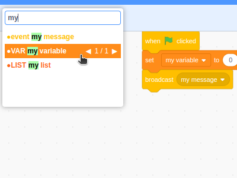

# Find Bar

Creates a search bar next to the sounds tab to find and jump to scripts, costumes and sounds.

### Features:

- By default, allows to search for hat blocks, variables, broadcasts, and custom blocks.
- Option to extend search and search for all blocks.
- Hotkey (Default: Ctrl + F) to open and close find bar.
- Up and Down Arrow keys to navigate between different items in find bar.
- Left and Right Arrow keys to navigate to next/previous block found in item.
- F2 and Shift + F2 provides the same functionality as the Left and Right Arrow keys.
- Middle Clicking or Shift Clicking on a variables, broadcasts, and custom blocks opens find bar and selects the block in the find bar.

### Todo:

- Search for string/numbers in block inputs
